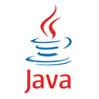
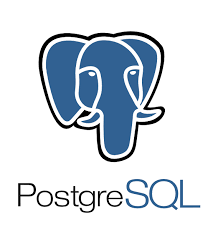

<div style="text-align: center;">
    
	
	
	
	
</div>


## Projeto da Amazon RDS e AWS Lambda com Java

__Esta documentação foi elaborada em 18/04/2025.__

> ### O que é a Amazon RDS?

A Amazon RDS (Relational Database Service), em português Serviço de Banco de Dados Relacional, 
é o serviço de Cloud da Amazon utilizado para criar instâncias de bancos de dados. Com este serviço 
você consegue criar instâncias de banco de dados para Aurora, MariaDB, MySQL, Oracle, PostgreSQL e 
SQL Server.

> ### O que é a AWS Lambda?

O AWS Lambda é o serviço da Amazon de computação sem servidor, que permite executar
códido de resposta a eventos sem a necessidade de provisionar ou gerenciar 
servidores. Nele você consegue executar códigos: Node.js, Python, Java, .Net e Ruby.

> ### Serviços utilizados

* Uma conta Free Tier na Amazon Web Service (AWS). Será necessário cadastrar um cartão de crédito.
* Amazon RDS
* AWS Lambda

> ### Ferramentas utilizadas

* Java 21
* IntelliJ IDEA Community Edition
* pgAdmin 4

> ### Criando uma instância de banco de dados na Amazon RDS

1. Acesse a AWS Console com o seu login [AWS Amazon Console](https://aws.amazon.com/pt/console/)

2. Clique em _Aurora and RDS_

3. Clique em _Criar banco de dados_

4. Em _Escolher um método de criação de banco de dados_, deixe selecionado _Criação Padrão_.

5. Em _Opções do mecanismo_, escolha entre um dos bancos de dados disponíveis, para este exemplo utilizaremos _PostgreSQL_.

6. Em _Modelos_, escolha a opção _Nível gratuito_.

7. Em _Configurações_ -> _Identificador da instância de banco de dados_, defina uma nome para a sua instância.

8. Em _Configurações de credenciais_ -> defina uma nome de usuário principal.

9. Defina em _Senha principal_ e _Confirmar senha principal_ a senha de acesso a sua instância.

10. Em _Conectividade_ -> _Acesso público_, defina como _Sim_. Isto permite o acesso externo a instância do banco de dados.

11. Clique no botão _Criar banco de dados_. Você será redirecionado para a página de banco de dados, neste momento, aguarde alguns segundos até a criação da sua instância de banco de dados ser criada.

**Observação:** existem outras opções disponíveis nos passos para a criação da instância do banco de dados porém, estas que foram citadas são as configurações mínimas para criação de uma instância RDS.

> ### Configurando o acesso banco de dados na Amazon RDS

1. Clique no nome da instância do banco de dados que foi criada.

2. Em _Segurança e conexão_ -> _Endpoint e porta_, copie o endereço do seu _Endpoint_. Este será o endereço para acesso a sua instância.

3. Abra a ferramenta de conexão com banco de dados de sua preferência. Neste exemplo utilizaremos o _pgAdmin_.

4. Informe os dados de conexão para o pgAdmin.

5. Em _Servers_ -> _Register_ -> _Server_.

6. Em _General_ -> _Name_ -> Informe o nome do seu servidor, algo do tipo Amazon RDS.

7. Em _Connection_, informe os dados abaixo:

* **_Hostname/address:_** endereco-do-seu-endpoit-amazon-rds
* **_Port:_** 5432
* **_Maintenance database:_** postgres _(Database padrão do postgres)_
* **_Username:_** postgres _(Usuário informado na criação da instância)_

6. Clique em _Save_ e informe a senha de acesso para conectar-se a sua instância.

**Observação:** Caso não consiga conectar a sua instância doo banco de dados, siga os seguintes passos a seguir:

1. Em _Segurança_, clique no nome do seu _Grupo de segurança da VPC_, este 
será algo como: default (sg-39h28f5e4e95e0427)

2. Em _Grupos de segurança_, clique no grupo de segurança listado abaixo.

3. Em _Regras de entrada_, clique em _Editar regras de entrada_ -> _Adicionar regra_.

4. Selecione em _Tipo_ -> _Todo o tráfego_, _Origem_ -> _Qualquer local-IPv4_ e clique em _Salvar regras_.

**Observação:** _Estes passos irá liberar qualquer tipo de entrada para a sua instância do banco de dados. Se preferir, você pode definir o acesso somente para um endereço IP específico._

> ### Criando o banco de dados na Amazon RDS com o pgAdmin

1. Após conectar a sua instância do banco de dados RDS.

2. Clique com o botão direito em cima de _Databases_ -> _Create_ -> _Database_

3. Em _Database_, informe nome para o seu banco de dados. Em nosso caso, _livraria-db_.

4. Deixe selecionado Owner padrão _postgres_.

5. Clique em _Save_.

Pronto! Seu banco de dados está criado.

> ### Criando tabelas

1. Expanda o banco de dados _livraria-db_ até chegar  _Schemas_ -> _public_ -> _Tables_.

2. Clique com o botão direito em cima de _Tables_ e selecione _Query Tool_.

Criando a tabela de autores

```
create table tbl_autores (
  id serial not null, 
  nome_autor varchar(65) not null,
  data_nascimento date not null,
  data_falecimento date default null,
  primary key (id)
);
```

Criando a tabela de livros

```
create table tbl_livros (
  id serial  not null, 
  autor_id int not null,
  titulo varchar(65) not null,
  descricao varchar(255) not null,
  isbn varchar(17) not null,
  ano_publicacao int not null, 
  numero_pagina int not null, 
  foreign key (autor_id) references tbl_autores (id) on delete restrict on update cascade,
  primary key (id, autor_id)
);
```

Inserindo dados na tabela autores

```
insert into tbl_autores (nome_autor, data_nascimento, data_falecimento) values ('Carlos Drummond de Andrade', '1902-10-31', '1987-08-17');
insert into tbl_autores (nome_autor, data_nascimento, data_falecimento) values ('Fernando Sabino', '1923-10-12', '2004-10-11');
insert into tbl_autores (nome_autor, data_nascimento, data_falecimento) values ('Rubem Braga', '1913-01-12', '1990-12-19');
insert into tbl_autores (nome_autor, data_nascimento, data_falecimento) values ('Paulo Mendes Campos', '1922-02-28', '1991-07-01');
insert into tbl_autores (nome_autor, data_nascimento, data_falecimento) values ('Cecília Meireles', '1901-11-07', '1964-11-09');
insert into tbl_autores (nome_autor, data_nascimento, data_falecimento) values ('Machado de Assis', '1839-06-21', '1908-06-29');
insert into tbl_autores (nome_autor, data_nascimento, data_falecimento) values ('Graciliano Ramos', '1892-10-27', '1953-03-20');
insert into tbl_autores (nome_autor, data_nascimento, data_falecimento) values ('Clarice Lispector', '1920-12-10', '1977-12-09');
```

Inserindo dados na tabela livros

```
insert into tbl_livros (autor_id, titulo, descricao, isbn, ano_publicacao, numero_pagina ) values (1, 'Titulo 1', 'Descricao 1', '0135468795413', 2017, 356);
insert into tbl_livros (autor_id, titulo, descricao, isbn, ano_publicacao, numero_pagina ) values (1, 'Titulo 2', 'Descricao 2', '3658748591253', 2015, 240);
insert into tbl_livros (autor_id, titulo, descricao, isbn, ano_publicacao, numero_pagina ) values (1, 'Titulo 3', 'Descricao 3', '1478596320125', 2014, 154);
insert into tbl_livros (autor_id, titulo, descricao, isbn, ano_publicacao, numero_pagina ) values (2, 'Titulo 1', 'Descricao 1', '2547859652540', 2022, 325);
insert into tbl_livros (autor_id, titulo, descricao, isbn, ano_publicacao, numero_pagina ) values (3, 'Titulo 1', 'Descricao 1', '0245895478202', 2010, 452);
insert into tbl_livros (autor_id, titulo, descricao, isbn, ano_publicacao, numero_pagina ) values (4, 'Titulo 1', 'Descricao 1', '0125879654820', 2011, 175);
insert into tbl_livros (autor_id, titulo, descricao, isbn, ano_publicacao, numero_pagina ) values (5, 'Titulo 1', 'Descricao 1', '2145896582548', 2022, 9542);
insert into tbl_livros (autor_id, titulo, descricao, isbn, ano_publicacao, numero_pagina ) values (5, 'Titulo 2', 'Descricao 2', '0254895632548', 2021, 753);
insert into tbl_livros (autor_id, titulo, descricao, isbn, ano_publicacao, numero_pagina ) values (6, 'Titulo 1', 'Descricao 1', '1254785963254', 2022, 123);
insert into tbl_livros (autor_id, titulo, descricao, isbn, ano_publicacao, numero_pagina ) values (6, 'Titulo 2', 'Descricao 2', '123658974150', 2023, 854);
insert into tbl_livros (autor_id, titulo, descricao, isbn, ano_publicacao, numero_pagina ) values (7, 'Titulo 1', 'Descricao 1', '2365897415204', 2024, 789);
insert into tbl_livros (autor_id, titulo, descricao, isbn, ano_publicacao, numero_pagina ) values (7, 'Titulo 2', 'Descricao 2', '9536587410215', 2025, 325);
insert into tbl_livros (autor_id, titulo, descricao, isbn, ano_publicacao, numero_pagina ) values (8, 'Titulo 1', 'Descricao 1', '0254896354784', 1995, 159);
insert into tbl_livros (autor_id, titulo, descricao, isbn, ano_publicacao, numero_pagina ) values (8, 'Titulo 2', 'Descricao 2', '1254850236985', 1992, 357);
```
Selecionando todos os registros de uma tabela individualmente

```
select * from tbl_autores;
```

```
select * from tbl_livros;
```

Criando junção entre tabelas

```
select tbl_autores.id, tbl_autores.nome_autor, tbl_autores.data_nascimento, tbl_autores.data_falecimento, 
tbl_livros.titulo, tbl_livros.descricao, tbl_livros.isbn, tbl_livros.ano_publicacao, tbl_livros.numero_pagina
from tbl_autores
inner join tbl_livros on tbl_autores.id = tbl_livros.autor_id
order by tbl_autores.nome_autor, tbl_livros.titulo;
```

> ### Criando o código Java para consulta a base de dados.

1. Abra o Intellij Idea e crie um novo projeto Maven.

2. No seu arquivo pom.xml, configure as dependências necessárias. _(Disponível no repositório)_

3. Crie o seu pacote dentro da pasta main/Java/nome-do-deu-pacote

4. Crie uma classe de nome LambdaPostgresConnector ou de sua preferência.

5. Insira o código Java. _(Disponível no repositório)_

> ### Compilando o seu projeto.

1. No Intellij, clique em Alt + F12 para abrir o _Terminal_.

2. Dentro da pasta do seu projeto, digite o seguinte comando e aperte ENTER: mvn clean package

3. O arquivo .jar do seu projeto será gerado dentro da pasta target.

4. Certifique que arquivo gerado tenha este nome nome-do-seu-projeto-1.0-SNAPSHOT-shaded.jar com a palavra shared no final. Este arquivo que será enviado para o ambiente da AWS Lambda.

> ### Realizando queries no Amazon RDS a partir de uma função no AWS Lambda

#### Criando a função Lambda

1. Acesse o AWS Lambda console

2. Em _Criar função_, deixe selecionado _Criar do zero_.

3. Em _Informações básicas_, informe o _Nome da função_.

4. Ainda _Informações básicas_, em _Tempo de execução_ escolha Java 21.

5. Em _Arquitetura_, x86_64.

6. Em _Alterar a função de execução padrão_, selecione _Criar uma função a partir da política da AWS templates_.

7. Ainda em _Alterar a função de execução padrão_ -> _Nome da função_, informe no nome da sua função.

8. Clique em _Criar função_.

#### Configurando permissões de acesso ao RDS

1. Selecionar a função criada.

2. Vá em _Configuração_ -> _Permissões_.

3. Clique no nome da função, abaixo de _Nome da função_ para abrir o console do AWS IAM.

4. Em _Políticas de permissões_, clique em _Adicionar permissões_, em seguida _Anexar políticas_.

5. Em _Outras políticas de permissões_, pesquise pela política AWSLambdaVPCAccessExecutionRole. 

6. Selecione a política e clique em _Adicionar permissões_.

Realizando estes passos, nossa função possuirá acesso para acessar nosso RDS.

#### Criando uma camada para importar o package Java

1. Na página principal Lambda Dashboard, clique em _Camadas_.

2. Clique em _Criar uma camada_.

3. Em _Configuração da camada_, informe o nome da sua camada.

4. Em _Fazer upload de um arquivo zip_, escolha no seu computador local, o arquivo jar contendo o seu código Java.

5. Em _Arquiteturas compatíveis - opcional_, escolha _86x_64_.

6. Em _Runtimes compatíveis - opcional_, escolha a versão Java no qual você gerou seu código ou na dúvida, todas as versões Java disponíveis.

7. Clique em _Criar_.

8. Vá até a sua Função, clique em _Camadas_ -> _Adicionar uma Camada_

9. Em _Escolha uma camada_, selecione _Camadas personalizadas_ e abaixo, seleione a camada no qual você acabou de criar.

10. Em Versão, escolha _1_, e clique em _Adicionar_.

#### Configurando um evento de teste

1. Clique na aba _Testar_.

2. Em _Evento de teste_ -> _Ação de evento de teste_, deixe selecionado _Criar novo evento_.

3. Em _Nome do evento_, informe o nome do seu evento.

4. Em _Configurações de compartilhamento de eventos_, selecione _Compartilhável_.

5. Em _JSON do evento_, deixei o conteúdo do JSON como a seguir: _{ "key1": "value1" }_

6. Clique em _Salvar_.

#### Configurando o Manipulador

1. Clique na aba _Código_, em _Configurações de tempo de execução_ -> _Editar_.

2. Em _Configurações de tempo de execução_ -> _Manipulador_, certifique-se de que o 
conteúdo da caixa segue esteja como a seguir: br.com.github.pedrossjr.LambdaPostgresConnector::handleRequest

3. Substitua _br.com.github.pedrossjr_ pelo nome do seu package java.

4. Em seguida clique em _Salvar_.

5. Volte para a sua função, clique na aba _Testar_, clqie no botão _Testar_.

>### Conclusão

Se você conseguiu chegar até aqui com sucesso, verá como resultado o JSON com a listagem de autores e seus livros conforme imagem abaixo.

